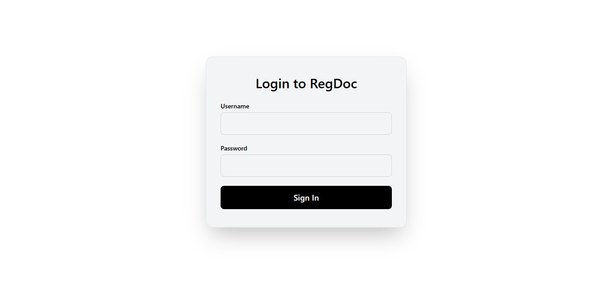
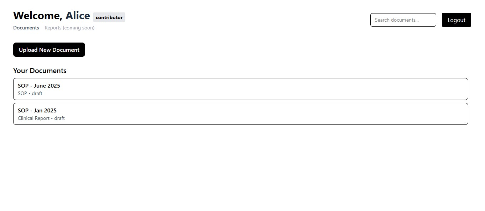
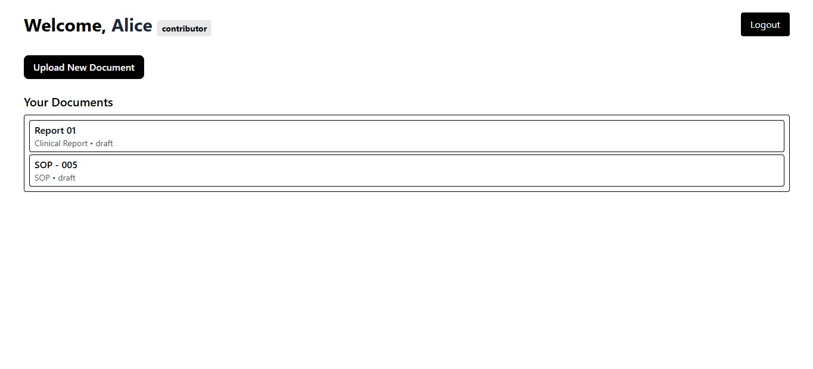
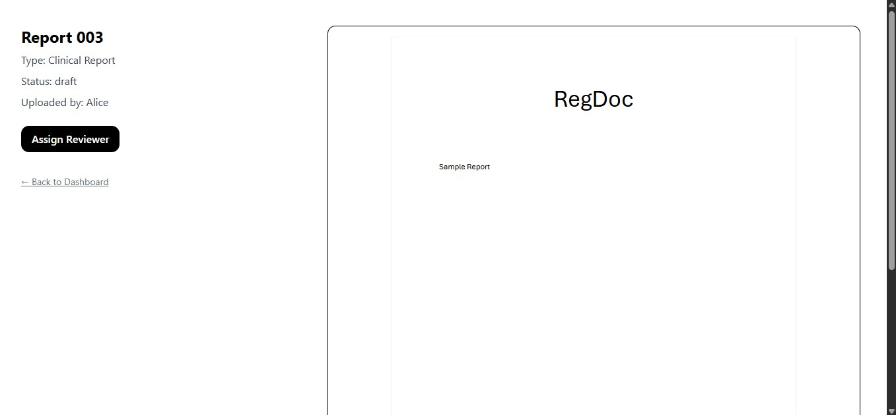
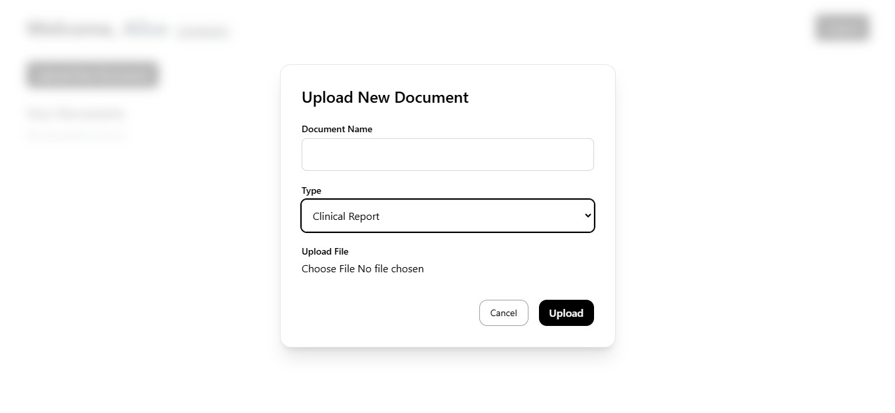
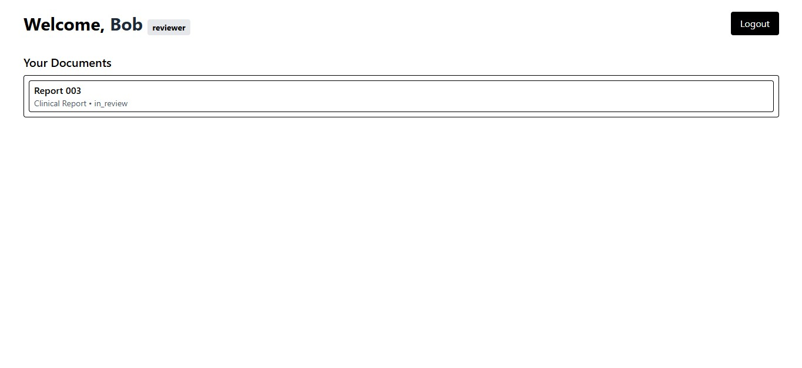
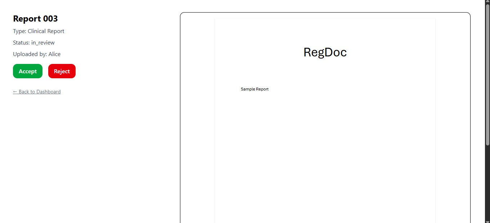

# RegDoc - Document Collaboration Workflow App

This is a lightweight document collaboration workflow app built with:

- **Frontend**: React + Tailwind + React Router + React PDF
- **Backend**: Flask (REST API), SQLite
- **Features**:
  - Role-based access (Contributor, Reviewer, Viewer)
  - Upload, preview, and review PDF documents
  - Assign reviewers and change document statuses

## Screenshots

<h4>Login</h4>

<h4>Contributor - Dashboard View</h4>

<h4>Contributor - Document View</h4>

<h4>Upload View</h4>

<h4>Reviewer - Dashboard View</h4>

<h4>Reviewer - Document View</h4>

